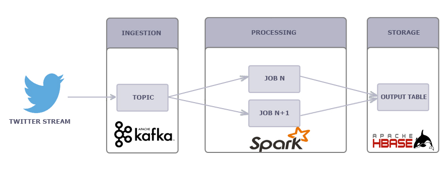

# Kafka-Spark-HBase-Sentiment-Analysis
# Description
This project is an implementation of a Big data workflow. It aims to manipulate different big data technologies such as Apache Kafka, Apache Spark and Apache Hbase. This application consists of a (dumb) sentiment analysis of a twitter stream that is based on computing a score for each tweet. The score is calculated as follows: for each tweet text eliminate the (stop words) , add +1 for positive words and retrieve  -1 for négative words.
The application is developed in Java 8.
The [Infrastructure] is based on docker. I used a docker compose file that launches Apache Kafka (a Kafka Broker), Apache Spark (a Driver container and 2 worker containers) and Apache Cassandra (Apache Cassandra container). More informations can be found in the [wurstmeister/kafka](https://hub.docker.com/r/wurstmeister/kafka) repository at docker hub.
 


# Architecture



The architecture consists of an ingestion and processing of a stream of Tweets consumed from the twitter developer Account. The result is stored in a database for visualization and querying.

 # Prerequisite

* Install Java8: 
* Install docker: you can use this script https://get.docker.com/

# Steps
1. [Clone the repo](#1-clone-the-repo)
2. [Set up the infrastructure](#2-Set-up-the-Kong-Ingress-Controller)
3. [Get the kafka container IP](#2-Set-up-the-Kong-Ingress-Controller)
4. [Launch the Ingestion Module](#3-create-the-database-service)
5. [Launch the Processing Module](#4-create-the-spring-boot-microservices)
6. [Visualize the results](#5-deploy-the-microservices)

### 1. Clone the repo

Clone this repository. In a terminal, run:

```
$ git clone https://github.com/ziedYazidi/Kafka-Spark-HBase-Sentiment-Analysis.git
```

### 2. Set up the infrastructure

### 3. Get the kafka container IP


* To 


You can access the database pod as follows:
```
$ TEST
```

### 4. Launch the Ingestion Module

**test** `test`


```bash
```

```yaml
```

### 5. Launch the Processing Module


### 6. Visualize the results


## References
* [test](url).


